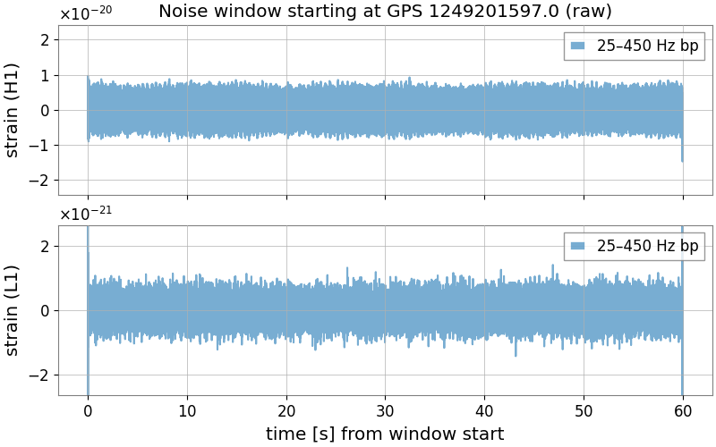
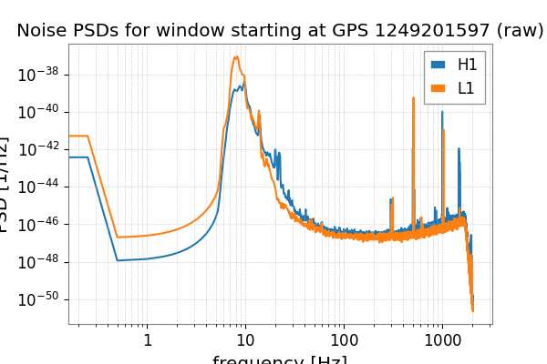
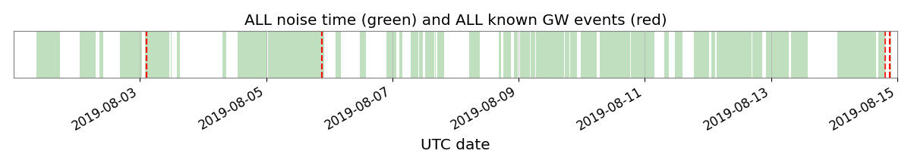

# Configuration

The main user-facing configuration file is:

```bash
configs/example.yaml
```

It is used by both the downloader and training script. Command-line arguments can override many of the same values, but editing the YAML file is the recommended starting point.

## `shared`

These settings should stay consistent between downloaded noise and training.

```yaml
shared:
  random_seed: 67
  sample_rate: 4096
  noise_is_whitened: false
  band_low: 25.0
  band_high: 450.0
  bandpass_order: 4
  psd_floor: 1.0e-48
  psd_outband: 1.0e40
```

`random_seed` controls reproducibility in both the downloader and training pipeline. In the downloader, it determines which files are selected when only a subset of the available time span is requested. During training, it controls model initialization, dataset sampling, and DataLoader worker randomness.

`sample_rate` should match the injection signal data.

Use `noise_is_whitened: false` for all runs. The downloader then saves raw detector strain and the training dataloader handles whitening and band-limiting internally. The whitened-noise option is retained for historical reasons.

`band_low` and `band_high` define the analysis frequency band, while `bandpass_order` controls the order of the corresponding bandpass filter. Within this band, PSD values below `psd_floor` are raised to `psd_floor`; outside the band, PSD values are replaced by the large constant `psd_outband`, suppressing those frequencies during whitening and SNR calculation. It's recommended to check noise PSD files (returned by the downloader if plot_psd is true) before changing these values.

## `paths`

```yaml
paths:
  data_dir: /path/to/train_val_hdf_dir
  noise_dir: /path/to/noise_dir
  checkpoint_dir: /path/to/checkpoints_dir
```

`data_dir` should contain the injection files used for training and validation. These files should be provided by the user, though we include a short example injection file in `example_data/train_val_hdf_dir`. See here, for more explanation on [data format and example injection data](data.md)

`noise_dir` is where the downloader writes HDF5 noise windows. It is also where training expects to find those files. These files should be generated by the download module, though we include a short example noise file in `example_data/noise_dir`.

`checkpoint_dir` is where training writes checkpoints, logs, and diagnostic plots.

## `download`

The downloader has separate modes for training noise, held-out test noise, and catalog-event windows.

Shared between all three modes are:

```yaml
download:
  window_len_s: 4096
  min_window_len_s: 64.0
```

`window_len_s` is the requested duration of each saved detector-data window.

`min_window_len_s` is the shortest event-centered signal window that may be saved when the full requested interval is unavailable. 

### Training noise

```yaml
download:
  train_noise:
    enabled: true
    gps_start: 1263081618
    gps_end: 1264291218
    n_segments: 32

    event_pad_s: 30.0
    glitch_sigma: 7.0
    glitch_max_frac: 0.001
    max_std_ratio: 20.0

    amp_thresh:
    rms_thresh:
    max_raw_std:
    min_raw_std:
```

`enabled` controls whether training-noise files are downloaded.

`gps_start` and `gps_end` define the GPS interval searched for coincident Hanford--Livingston data. These values should be replaced with the desired training period.

`n_segments` limits the number of accepted windows saved. Leave it blank to retain all accepted windows found in the requested interval.


Training-noise windows exclude padded regions around cataloged events and can undergo lightweight glitch cleaning and quality-control rejection:

- `event_pad_s` controls how much time is excluded around known events when downloading noise-only windows.
- `glitch_sigma` sets the threshold for short-glitch cleaning. Samples whose bandpassed strain exceeds this many robust standard deviations from the local median are interpolated over.
- `glitch_max_frac` rejects the full window if more than this fraction of samples are flagged as glitches.
- `max_std_ratio` rejects windows where the H1 and L1 bandpassed standard deviations differ too strongly, which helps remove windows where one detector is much noisier than the other.
- `amp_thresh` optionally rejects windows whose maximum absolute bandpassed strain is too large. Leave blank to disable.
- `rms_thresh` optionally rejects windows whose bandpassed RMS is too large. Leave blank to disable.
- `max_raw_std` and `min_raw_std` optionally reject windows whose QC/bandpassed standard deviation is outside the requested range. Leave blank to disable.

 They are meant to reject or clean obviously problematic windows, not to replace full LIGO data-quality procedures. 
 
 
<p align="center">
  
</p>

<sup>Example bandpassed H1/L1 noise segment produced by the downloader diagnostics.</sup>

<p align="center">
  
</p>

<sup>Example PSD diagnostic plot saved with a downloaded noise window.</sup>

### Test noise and catalog events

```yaml
download:
  test:
    gps_start: 1264291218
    gps_end: 1267056018

    noise:
      enabled: true
      n_segments:

    signal:
      enabled: true
      n_events:
```

`test.gps_start` and `test.gps_end` define the held-out evaluation interval. These values should be replaced with the desired test period and should not overlap the training interval.

`test.noise.enabled` controls whether coincident background-noise windows are saved. `n_segments` limits the number of test-noise windows; leave it blank to keep all available windows.

`test.signal.enabled` controls whether windows centered on cataloged gravitational-wave events within the test interval are saved. `n_events` limits the number of events; leave it blank to retain all cataloged events found in the interval.

Unlike training noise, test noise is retained without downloader-level quality-control rejection. The corresponding quality-control flags are stored as metadata for later analysis.


### PSD and diagnostic plots


The diagnostic plot options are:

```yaml
download:
    plot_timeline: true
    plot_timeseries: true
    plot_psd: true
    target_plot_fs: 1024.0
    psd_seglen_s: 4.0
```

`psd_seglen_s` sets the Welch segment length, in seconds, used to estimate the PSD saved with each HDF5 file.

The plotting options save diagnostic summaries of the downloaded data:

- `plot_timeline` shows valid and saved intervals within the requested GPS range.
- `plot_timeseries` saves example strain plots.
- `plot_psd` saves PSD plots.
- `target_plot_fs` controls only the plotting sample rate; it does not alter the saved detector data.


<p align="center">
  
</p>

<sup>Example downloader timeline showing valid data intervals in the requested GPS range.</sup>

<p align="center">
  
</p>

<sup>Example downloader timeline showing the windows saved after QC and selection.</sup>


## `model`

```yaml
model:
  name: model_tcn_earlyfusion
  kwargs: {}
```

`model.name` selects which model definition is used by `train.py`. The default is `model_tcn_earlyfusion`. Further details on the model architectures, including their design and relevant references, are provided in the accompanying paper.

All model files live in `models/` and expose a `full_module` class/function. `model.kwargs` can be left as `{}` for standard runs. Use it when testing a model hyperparameter variant.


## `training`

Commonly changed options:

```yaml
training:
  train_file: train.hdf
  val_file: val.hdf
  batch_size: 32
  num_workers: 4
  lr_init: 0.001
  max_epochs: 100
```
`batch_size` controls the number of examples per batch.

`num_workers` controls dataloader parallelism. Use 0 for local debugging if multiprocessing causes problems.

`lr_init` is the initial Adam learning rate.

`max_epochs` is the maximum number of epochs before training is stopped, regardless of loss.


Data and label settings:

```yaml
training:
  dim: 1024
  segment_length: 4096
  edge_buffer: 2048
  whitening_context_seconds: 8.0
  normalize_per_window_shared: true
  noise_prob: 0.60
```

`dim` is the number of samples immediately before merger that are labeled as signal during training. Like `segment_length`, this should be adapted to the signal class. 

`segment_length` is the number of samples fed to the model. The corresponding signal duration is `segment_length / sample_rate` seconds. This value should be adapted to the signal class. For example, BNS signals are typically much longer in-band than BBH signals, so BNS searches may benefit from a larger `segment_length`. 

`edge_buffer` trims whitening/filtering edge artifacts.

`whitening_context_seconds` controls the duration of raw strain used to whiten each training example before cropping to the model input.

`normalize_per_window_shared: true` applies one common normalization scale to both detector channels within each sample. This stabilizes the overall input scale while preserving the relative H1/L1 amplitudes.

`noise_prob` is the probability of drawing a noise-only example. The remaining samples contain injected signals.

Curriculum settings:

```yaml
training:
  p_higher_init: 0.90
  p_higher_fin: 0.25
  snr_range_high: [10.0, 25.0]
  snr_range_low: [7.0, 15.0]
```


`snr_range_high` and `snr_range_low` define the target matched-filter SNR ranges used for injected training examples. At each epoch, the dataloader samples from `snr_range_high` with `probability p_higher`; otherwise it samples from `snr_range_low`.

`p_higher_init` and `p_higher_fin` control the schedule for p_higher. Training starts near `p_higher_init` and decays toward `p_higher_fin` over 10 epochs, so early epochs see more high-SNR examples and later epochs see more lower-SNR examples.

Check [here](training.md) for more details on what parameters to change to improve training performance. 
