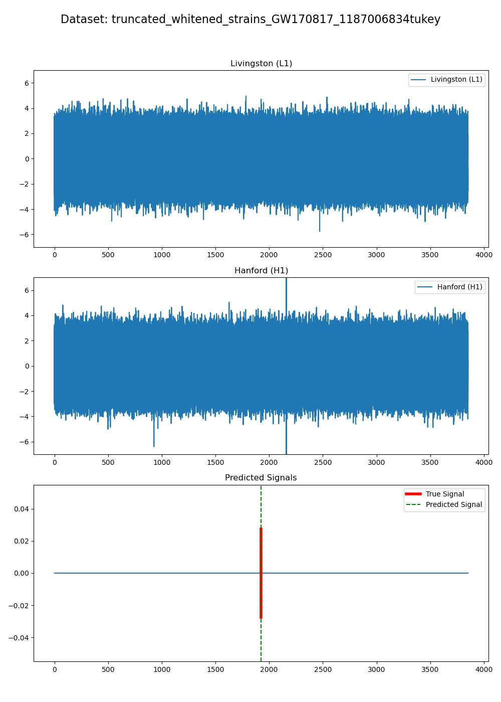

# Inference

Use the inference notebook after training to load a checkpoint and inspect model predictions on selected strain examples.

The model outputs a score between 0 and 1 at each time step. Treat these scores as confidence values, not calibrated probabilities.

## General inference flow

<p align="center">
  
</p>

<sup>Example inference output for GW170817, with a single clear trigger near the event.</sup>

1. Load detector strain.
2. Slice it into overlapping windows.
3. Run the trained model on each window.
4. Combine window-level predictions.
5. Use peak finding to identify candidate triggers.
6. Plot strain, prediction score, and detected trigger times.

## Peak-finding parameters

The older README described two especially important inference knobs:

```text
threshold
width
```

`threshold` is the minimum peak height.

`width` requires the prediction to be sustained rather than a one-sample spike.

Use one consistent set of peak-finding parameters for a given checkpoint comparison. Changing them mid-analysis changes the false-positive/false-negative behavior and makes comparisons harder to interpret.

## Interpreting output

A trigger time should be interpreted relative to the strain file being evaluated. Check the notebook and filename conventions to confirm whether times are seconds since file start, GPS time, or another local offset.

## Good practice

Validate threshold and width on held-out validation examples before using true events as a final test.

Keep inference preprocessing consistent with the training setup.

Do not tune peak-finding parameters on the final test set.
