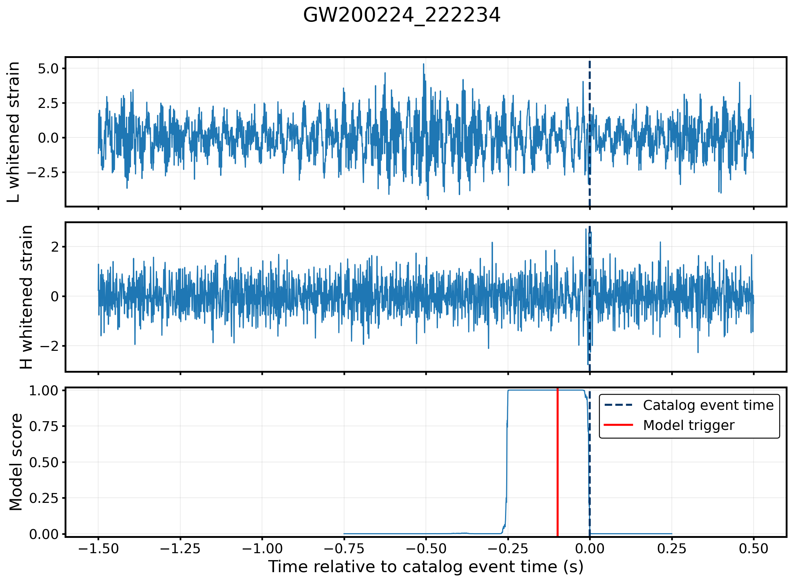

# Inference

The inference script applies one trained AttenGW checkpoint to raw, downloader-produced HDF5 files and constructs candidate triggers over a configurable set of operating points. Because the script may be used for several different purposes (including real-noise searches, testing, validation, and injection studies) it deliberately avoids higher-level analysis tasks and instead aims to provide the minimum complete pipeline needed for inference: model-compatible preprocessing, scoring, trigger construction, ASD mismatch calculation, and limited post-processing. 

Model preprocessing is read from the checkpoint run's saved training configuration so that inference remains consistent with training.

The model outputs a score between 0 and 1 at each timestep. These scores should be treated as detection statistics, not calibrated probabilities.

## General inference flow

1. Resolve one checkpoint and load its saved `config.yaml`.
2. Load each raw H1/L1 HDF5 file and check that its metadata is compatible with training.
3. Whiten, normalize, and divide the strain into overlapping model windows using the training and inference settings.
4. Score every window once.
5. Apply every enabled threshold, smoothing, and peak-width combination to the saved scores.
6. Merge repeated detections from overlapping windows.
7. Optionally calculate one full-file ASD-mismatch value for each input file.
8. Write one complete text report for every trigger operating point.

## Example trigger

The figure below shows an example recovery of `GW200224_222234`. The top two panels show the Hanford and Livingston strain, and the bottom panel shows the model score. The dashed blue line marks the catalog event time provided by GWOSC, while the red line marks the trigger selected by the `smoothed_max` method.

<p align="center">
  
</p>

## Running inference

Edit:

```bash
configs/inference_example.yaml
```

Then run:

```bash
python inference/infer.py --config configs/inference_example.yaml
```

Optional SLURM usage (edit `submit_infer.slurm`'s header to adapt it to your machine):

```bash
sbatch scripts/submit_infer.slurm
```


## Input data and checkpoint

The main paths are:

```yaml
paths:
  input_dir: /path/to/evaluation/files
  output_dir: /path/to/inference/output

  checkpoint_dir: /path/to/train_job
  checkpoint:

  training_noise_dir: /path/to/training/noise
```

`input_dir` may be a directory, a single HDF5 file, or a glob containing the raw noise or signals files that the user wishes to evaluate using the trained model. A directory is searched non-recursively for `.hdf` and `.hdf5` files. The script creates an `infer_job_<jobid>/` folder below `paths.output_dir` with the inference output files and config information. 

Set exactly one of:

- `checkpoint_dir`: a training-run folder containing `config.yaml` and one or more `.ckpt` files. The checkpoint with the lowest `val_loss` in its filename is selected.
- `checkpoint`: one specific `.ckpt` file. Its parent directory must contain the corresponding `config.yaml`.

Each input file must contain:

```text
/strain_H1
/strain_L1
/psd_H1
/psd_L1
/freqs
```

The strain must be raw and unwhitened, with the HDF5 attribute `whiten: false`. The saved training config must likewise use:

```yaml
shared:
  noise_is_whitened: false
```

Sample rate, frequency band, model architecture, segment length, edge buffer, whitening context, normalization, and PSD handling are infered from the saved training config.

`paths.training_noise_dir` may be a directory, a single file, or a glob of raw training-noise HDF5 files. These will be used to derive a similarity metric between the noise files the model was trained on and the noise files it sees during inference. If this similarity metric is not of interest, set:

```yaml
asd_mismatch:
  enabled: false
```

## Inference config

The basic inference settings are:

```yaml
inference:
  device: auto
  batch_size: 32
  stride: 4096
  offsets: [0, 1024, 2048, 3072]
```

`stride` sets how many time steps the model advances between successive scoring positions. At each position, it sends one window for every value in `offsets`, with each window shifted by the corresponding number of time steps. Thus, the same strain is evaluated with overlapping window placements.

The metadata checks are controlled by:

```yaml
sanity_checks:
  strict: true
  check_sample_rate: true
  check_bandpass: true
```

With `strict: true`, missing or inconsistent sample-rate and band metadata cause that input file to fail. With `strict: false`, the mismatch is recorded as a warning in the reports. Raw, unwhitened strain is always required.

## Trigger construction

The shared thresholds and merge tolerance are:

```yaml
triggers:
  thresholds: [0.995, 0.999, 0.9995, 0.9999]
  merge_tolerance_s: 0.25
```

I.e., here, triggers returned from overlapping windows that are within 0.25s of each other are merged. Every enabled method is evaluated at every threshold.

### Smoothed maximum

```yaml
smoothed_max:
  enabled: true
  smooth_samples: 64
```

The score is smoothed with a moving average, and the maximum in each model window becomes a candidate when it exceeds the threshold.

### Peak width

```yaml
peak_width:
  enabled: true
  widths: [512, 992]
```

Candidate peaks must exceed the threshold and satisfy the requested minimum width. Widths are given in samples. Peak locations and widths are identified using SciPy’s [`scipy.signal.find_peaks`](https://docs.scipy.org/doc/scipy/reference/generated/scipy.signal.find_peaks.html) function.

### Full peak

```yaml
full_peak:
  enabled: true
  widths: [512, 992]
  mean_margin: 0.05
  mean_cap: 0.95
```

`full_peak` applies the same peak-height and width requirements, then also requires more than half of the peak body to exceed

```text
max(0, min(mean_cap, threshold - mean_margin)).
```


## ASD mismatch

ASD mismatch provides a simple measure of how different an evaluation file's detector noise is from the noise used for training. It is optional:

```yaml
asd_mismatch:
  enabled: true
  k_nearest: 1
  welch_seconds: 8.0
  welch_overlap: 0.5
  smooth_bins: 9
```

For a detailed definition of the ASD-mismatch statistic and its use in evaluating distribution shift, see the accompanying [paper](https://arxiv.org/abs/2512.12513). For each complete training and evaluation file, the script:

1. estimates the H1 and L1 PSDs with Welch's method;
2. converts them to log ASDs within the training frequency band;
3. averages the H1 and L1 log-ASD features;
4. optionally smooths the feature across frequency bins;
5. calculates the mean absolute feature distance to every training-noise file.

The reported value is

```text
ASD mismatch = exp(mean distance to the k nearest training files).
```

A value of 1 corresponds to an identical ASD feature; larger values indicate greater mismatch. The value is descriptive only: it does not alter the model score or trigger selection. One scalar is reported per complete input file though more fine grained comparison between smaller noise segments may be desirable.


## Outputs

One self-contained text report is written for each method, threshold, and width combination, for example:

```text
smoothed_max_threshold_0p9999.txt
peak_width_threshold_0p9999_width_512.txt
full_peak_threshold_0p9999_width_992.txt
```

Each report contains:

- inference run-level information:
  - checkpoint, model, device, and effective preprocessing settings;
  - trigger method and operating point;
  - merged-trigger, false-positive, recovery, and unclassified totals where the noise/signal hdf file metadata permits;
- one section for every requested input noise/signal hdf file, containing:
  - file metadata;
  - full-file ASD mismatch;
  - number of windows scored;
  - every merged trigger with its sample index and, when available, GPS and UTC time;
  - explicit failure details if the file could not be processed.
  
A file with no triggers is still included. False-positive and recovery totals are marked unavailable or partial when the required metadata is missing or a file failed.

## Good practice

Choose thresholds and trigger settings using held-out development data rather than the final test interval. Keep the inference preprocessing tied to the checkpoint's saved training config, and inspect metadata warnings, failed files, and ASD mismatch before interpreting recovery or false-positive counts.
