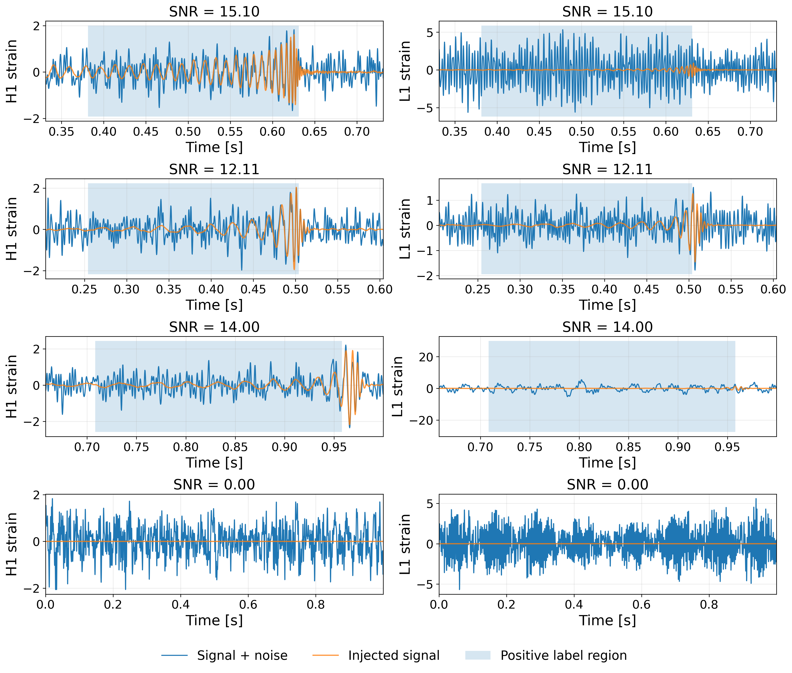
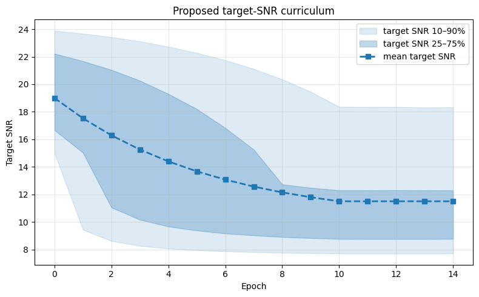

# Training guide

This page gives a practical overview of how training works and what to change when the model is not behaving well. For a plain description of every config option, see [config.md](config.md).

## Current recommended data flow

<p align="center">
  
</p>

<sup>Example training windows generated by the dataloader. The shaded regions mark the positive target region immediately before merger.</sup>


For new runs, always use the raw-noise workflow:

```yaml
shared:
  noise_is_whitened: false
```

In this mode, the downloader saves raw H1/L1 detector strain together with PSDs. The training dataloader then builds examples dynamically from user-provided synthetic injections and downloaded real noise.

For each sample, the dataloader first decides whether to draw a signal-plus-noise example or a pure-noise example. This is controlled by `noise_prob`.

For signal-plus-noise examples, it:

1. loads one synthetic H1/L1 waveform pair from `training.train_file` or `training.val_file`,
2. finds the merger time from the waveform peak,
3. selects one of the downloaded real-noise HDF5 files,
4. builds band-limited PSD interpolants from that selected noise file,
5. estimates the waveform's matched-filter-style network SNR,
6. rescales the waveform into the selected training SNR range,
7. injects the waveform into raw detector noise,
8. whitens the combined strain using the noise PSDs and a configurable whitening context length,
9. removes per-channel DC offsets and optionally applies shared normalization,
10. crops a `segment_length` window around the injected merger (merger placed randomly in second half of window),
11. returns the two-channel strain window and a binary target mask.

For noise-only examples, it draws a raw detector-noise window and applies the same whitening, normalization, and cropping procedure before returning an all-zero target mask.

The input tensor has shape:

```text
[segment_length, 2]
```

corresponding to L1 and H1.

The target has shape:

```text
[segment_length, 1]
```

and is set to 1 for the `dim` samples immediately before the merger and 0 elsewhere. For pure-noise examples, the target is all zeros.

The model outputs one confidence score per timestep and is trained with binary cross-entropy against this mask.

## Paper-tested BBH starting point

The final BBH configuration selected from the paper's O3a development study used:

```yaml
model:
  name: model_tcn_earlyfusion

training:
  batch_size: 32
  lr_init: 0.001
  max_epochs: 75

  segment_length: 4096
  dim: 1024
  edge_buffer: 2048
  whitening_context_seconds: 8.0
  normalize_per_window_shared: true

  noise_prob: 0.65
  p_higher_init: 0.90
  p_higher_fin: 0.25
  snr_range_high: [10.0, 25.0]
  snr_range_low: [3.0, 10.0]
```

At a sample rate of 4096 Hz, this corresponds to a one-second input window and a 250 ms positive label.

The accompanying ablations found that:

- the early-fusion TCN performed comparably to the strongest tested models while remaining the simplest retained architecture;
- shared per-window normalization reduced seed-to-seed variation;
- an 8-second whitening context outperformed the tested 4-, 16-, and 32-second alternatives;
- the 1024-sample label outperformed a 512-sample label for the tested BBH population;
- stricter glitch rejection did not improve convergence;
- curricula restricted to relatively high SNRs performed poorly;
- the selected `[3,10]` / `[10,25]` curriculum balanced weak-signal exposure with a broad higher-SNR component.

These findings apply to the tested BBH data, noise periods, and implementations. Longer-duration signals or substantially different noise conditions may require different window, label, whitening, and curriculum settings. The TCN-based models outperformed the more complex alternatives, although further hyperparameter tuning and architectural optimization may improve the performance of all models. Users are encouraged to experiment with the provided implementations or define their own architectures by adding or modifying model files in `models/`.


## What to change first

Validation loss alone is not a strong measure of detector performance. Evaluate checkpoints on held-out real detector data, using the metrics most relevant to the application, such as recall, precision, false-positive rate, sensitive volume, etc. When a run performs poorly, try these steps in roughly this order of importance:

1. inspect the training preview, downloader diagnostics, and injected signals for data problems or mismatches between data preprocessing, training, and inference;
2. increase the size and diversity of noise background seen during training
3. verify that the behavior is consistent across multiple training seeds (if you haven't yet, enable shared per-window normalization if performance is unstable across seeds);
4. adjust `noise_prob` and the SNR curriculum;
5. change whitening, window, or label settings only when the signal population or diagnostics justify it;
6. adjust optimizer and learning rate curriculum only when the loss curve indicates an optimization problem.
7. change preprocessing/band settings only if the data diagnostics suggest a mismatch.
8. inspect the inference setup before retraining, since thresholds, smoothing, overlap, or trigger construction may be causing the poor performance;
8. experiment with different model families and hyperparameters

Avoid assuming that stricter noise cleaning will improve performance. In the accompanying ablations, stricter glitch rejection slowed convergence without improving the final detector. Change one group of settings at a time. This model is sensitive to the balance between signal vs noise-only examples, SNR distribution, and detector-noise quality.

## Main training knobs

### SNR curriculum


The raw-noise dataloader uses a simple two-bin mixture schedule SNR curriculum. Injected examples are rescaled to a target matched-filter SNR sampled from one of two ranges. During early epochs, examples are more likely to be drawn from the higher-SNR range. As training progresses, this probability decays, so the model sees more lower-SNR examples.

The exposed curriculum parameters are:

```yaml
p_higher_init: 0.90
p_higher_fin: 0.25
snr_range_high: [10.0, 25.0]
snr_range_low: [7.0, 15.0]
```

At each epoch, the dataloader samples from `snr_range_high` with probability `p_higher`; otherwise it samples from `snr_range_low`. `p_higher` decreases from `p_higher_init` toward `p_higher_fin` over roughly the first ten epochs. Change `snr_range_high` and `snr_range_low` if you want different target-SNR ranges. Change `p_higher_init` and `p_higher_fin` if you only want to change how often the higher-SNR range is sampled.

If real-signal recovery is promising but still suboptimal, the SNR curriculum is one of the most important settings to revisit, particularly the low- and high-SNR ranges and how frequently each is sampled. These parameters, together with `noise_prob` should be tuned together, since the best balance is often non-obvious and usually requires experimentation.



*Example target-SNR curriculum for a two-bin mixture schedule with `high_range=[15,25]`, `low_range=[7,13]`, `p_high_init=0.90`, and `p_high_final=0.15`. The dashed line shows the expected target SNR, while the shaded regions indicate the 25–75% and 10–90% sampled target-SNR ranges across epochs.*


### `noise_prob`

`noise_prob` controls how often the dataloader returns a pure-noise example.

A larger value exposes the model to more background examples, while a smaller value provides more injected signals. This parameter interacts with the SNR curriculum, thus there may be a range of optimal SNR curriculum + noise probability values. A reasonable starting range is:

```text
0.60–0.70
```

### Shared normalization: `normalize_per_window_shared`

```yaml
normalize_per_window_shared: true
```

Whitening corrects the frequency-dependent noise scale but does not guarantee a consistent overall time-domain amplitude. Shared normalization applies one scale to both detector channels, preserving their relative amplitudes. However, normalization may also remove important scale information.

In our multi-seed experiments, normalization did not substantially change median sensitivity but reduced seed-to-seed variation and improved training stability. It is therefore recommended for new runs.


### Label width: `dim`

`dim` controls how many samples immediately before merger are labeled as signal.

Larger labels make the task easier and produce broader peaks. Smaller labels give sharper timing but can make training harder. At 4096 Hz:

```text
dim = 512   ->  0.125 s
dim = 1024  ->  0.250 s
dim = 2048  ->  0.500 s
```

Choose this based on the signal duration and inference trigger logic. For the tested BBH population, `dim: 1024` performed well. `dim: 1024` may thus remain a good starting point for other signal classes.

### Window length: `segment_length`

`segment_length` is the number of samples seen by the model. At 4096 Hz:

```text
segment_length = 4096  ->  1 second
```

Change this only if the signal class needs more context. Longer windows cost more memory and may require changes to the label width, inference offsets, and peak-finding settings.

### Whitening context: `whitening_context_seconds`

```yaml
whitening_context_seconds: 8.0
```

The whitening context is the amount of surrounding raw strain whitened before the final model window is cropped.

Shorter contexts may estimate the local spectrum less reliably, while longer contexts cost more and may be less representative of the immediate noise. 8.0 seconds are considered a good starting point. 

### Edge buffer and band settings

`edge_buffer` helps keep whitening/filtering edge artifacts away from the final training window. Increase it if preview plots show edge artifacts leaking into samples.

`band_low`, `band_high`, `psd_floor`, and `psd_outband` affect PSD interpolation and whitening. Keep the default 25–450 Hz range unless PSD plots or noise diagnostics suggest a mismatch.

### Learning rate and scheduler

The training script uses Adam, binary cross-entropy, and `ReduceLROnPlateau`. The main exposed optimizer setting is:

```yaml
lr_init: 0.001
```

Experiments suggest that a more responsive learning rate scheduler performs better. 

## Diagnostics

At the start of training, the script runs early diagnostics on rank 0. These print validation-set raw strain amplitude statistics and matched-filter SNR statistics from a sample of validation injections.

For the current raw-noise path, the script also saves:

```text
training_batch_preview.png
```

in `checkpoint_dir`.

This plot shows randomly generated training windows, including the detector channels, target region, clean signal overlay for injected examples, and approximate SNR. Use it before trusting a long training run.

Check that:

- signals have the expected morphology
- injected mergers fall within the expected part of the window;
- the highlighted positive-label region immediately precedes the merger;
- pure-noise examples have all-zero targets;
- both detector channels have plausible scales;
- the plotted SNRs look plausible for the intended curriculum.

## Validation, seeds, and final testing

Do not rely only on training or even validation loss to evaluate performance. The strongest validation is to validate the model on entirely different noise segments from those seen during training and to use a more production-relevant metric, such as recall/precision/sensitive volume vs false alarm rate/etc. 

All the experiments and optimizations described in this document should be performed on train and validation data only. Keep the final test interval untouched until the architecture, training settings, checkpoint-selection rule, inference procedure, and threshold have been fixed. The downloader's separate `train/` and `test/` structure is intended to support this separation and prevent train/test leakage.


## Legacy mode

The repository still contains an older dataloader path for pre-whitened noise:

```yaml
shared:
  noise_is_whitened: true
```

This changes more than the noise file format: signal/noise mixing, SNR meaning, and preview diagnostics differ from the current raw-noise workflow. For new runs, keep `noise_is_whitened: false`. This configuration is retained only for historical reasons but is not recommended.
